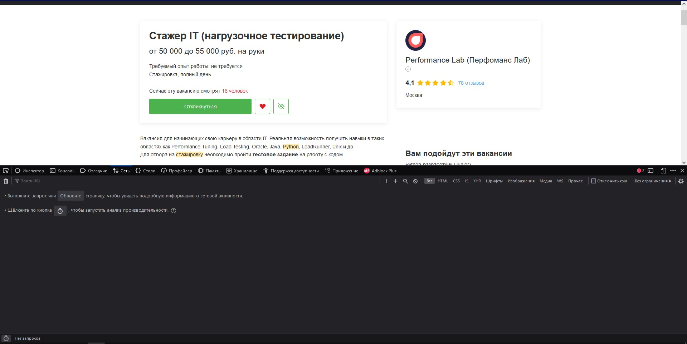
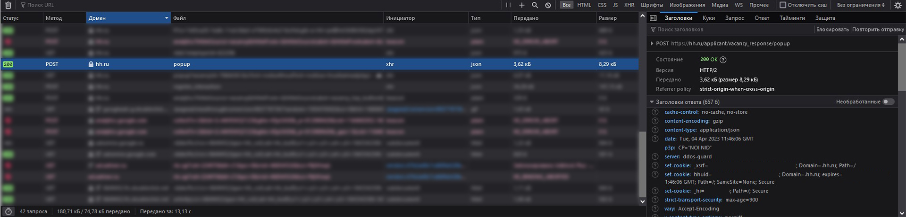
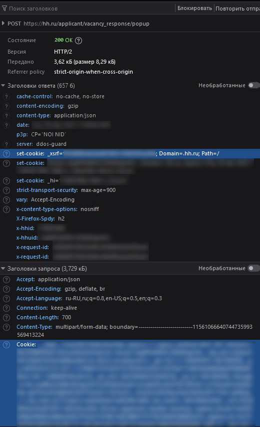

# hhauto
Автоматизация отправки откликов на hh.ru

Скрипт написан на python 3.10

Для того чтобы воспользоваться скриптом нужно:
  1) Скачать репозиторий
  2) Открыть проект и находясь в его папке прописать 
  ```pip install -r requirements.txt```
  3) Вставить нужные данные:
  Открыть консоль и перейти во вкладку "Сети"/"Network":
    
   
   
  Сделать октлик и отсортировать по домену, где найти "hh.ru" и "popup" событие
       
   
   
  Найти справа поле Cookie, скопировать его и вставить в код
  
  
   
    
    
  Создай URL запрос для "своих" вакансий и вставь его в код
    
  4) Готово! Запускай скрипт!
